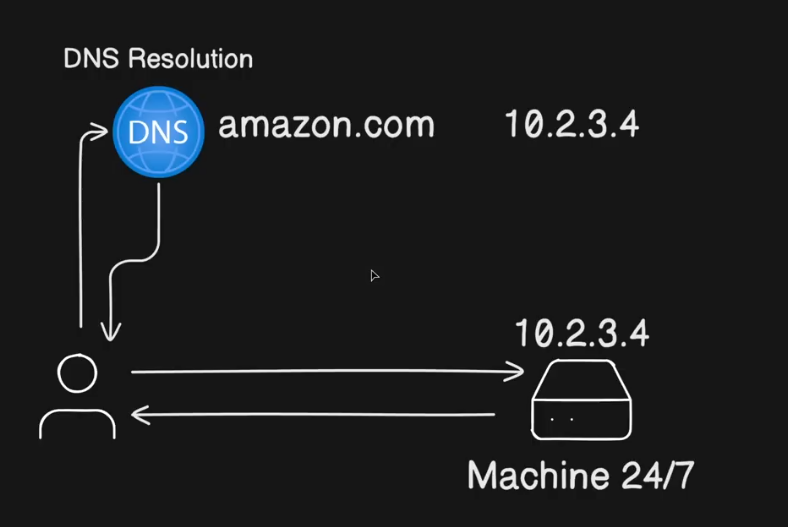
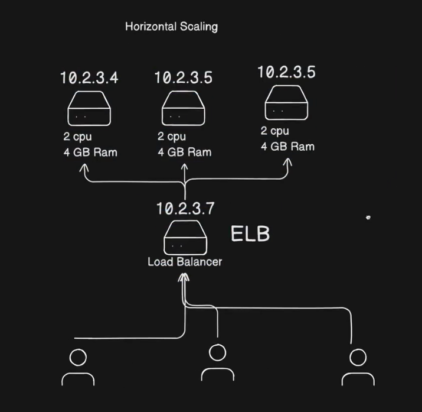
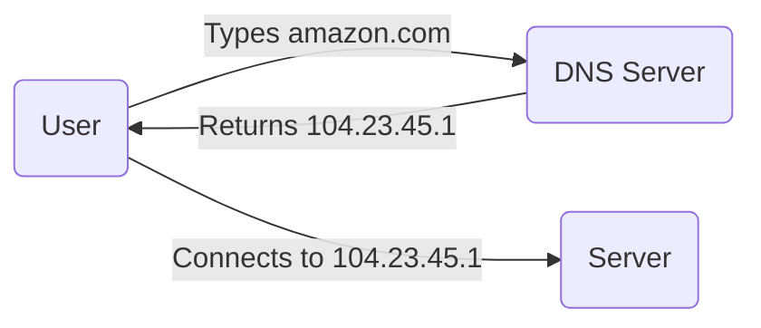
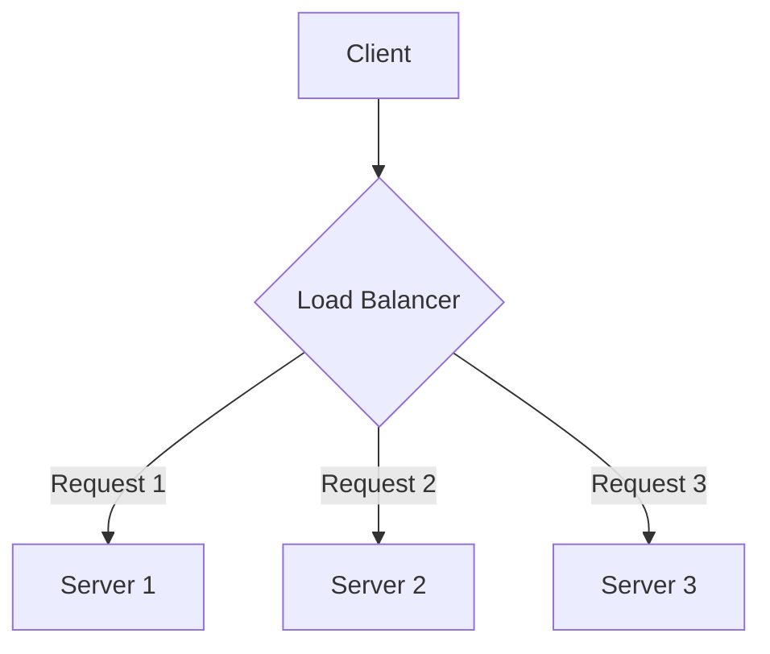
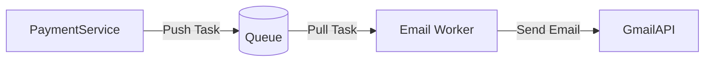
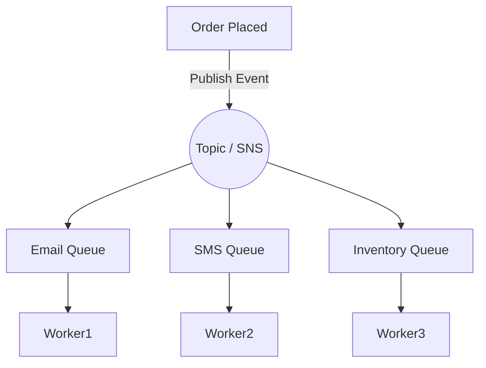
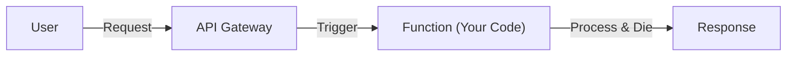
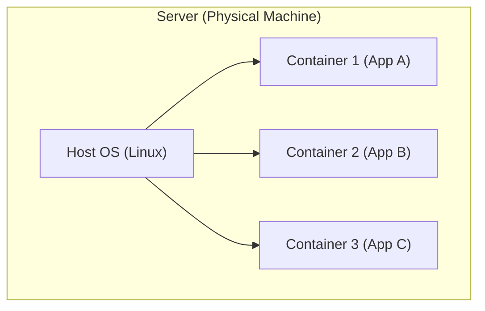

# 1) DNS Resolution

1) Here when a user want to send a request to Machine/Server he has to use Server's IP address which is 10.2.3.4 but it is hard to remember

2) To make it easier DNS (Domain Name System) came into picture 

> **DNS** :- It is directory which holds the name of the IP address like 10.2.3.4(Amazon.com) so when a user enters amazon.com DNS sends user to 10.2.3.4 (server)

 ---
> **Vertical Scaling** = Vertical scaling, also known as scaling up, involves increasing the capacity or capabilities of a single hardware or software component within a system. This is done by adding more resources like CPU, RAM, or disk space to an existing server or VM, or by upgrading the server to a more powerful instance.

>**Down Time Problem With Vertical Scaling** - When suddenly the number of users or load increases then the server needs to restart itself to add more CPU's and RAM so for that moment the whole server gets down this is the problem of vertical scaling which is called as a **Down Time**

>**Horizontal Scaling** - It means adding more servers 

->When U use Horizontal Scaling you have to add a Load balancer (A dedicated Server to distribute the traffic) it is also called as a ELB(Elastic load Balancer)

->Now when ever user increases new servers are added and ELB knows this and send the incoming traffic to those servers.

->After the use these servers can again spin down 

->Here Load balancer is nothing but a dedicated server designed to handle traffic
Ip address of this ELB is given to DNS 

->Load Balancer is always given high power as compared to other servers

# Proper Notes

# 📘 System Design: The Beginner's Guide

### 1. The Core: Client & Server

**Concept:** The most basic interaction on the internet.

* **Client:** The device asking for something (Your phone, laptop).
* **Server:** A computer running 24/7 that has the information. It has a **Public IP Address** (like a phone number) so anyone can find it.

**Analogy:**

> **Client** = Customer in a restaurant.
> **Server** = Kitchen that prepares the food.

---

### 2. DNS (Domain Name System)

**Concept:** Humans are bad at remembering numbers (IP addresses like `104.23.45.1`). We prefer names (`amazon.com`).

* **How it works:** It’s the phonebook of the internet. You give it a name, it gives you the IP address.

---

### 3. Scaling: Handling the Crowd

When your app goes viral, one server crashes. You have two ways to fix this:

#### **A. Vertical Scaling (Scale Up)**

**Concept:** Making your existing server stronger (More RAM, faster CPU).

* **Pros:** Easy to do.
* **Cons:** Expensive and has a limit. **Major Drawback:** You must switch off the server to upgrade it (Downtime).

#### **B. Horizontal Scaling (Scale Out)**

**Concept:** Buying more servers (adding replicas). Instead of one super-computer, you have 3 average ones.

* **Pros:** Infinite scaling, cheaper.
* **Cons:** Complex to manage (needs a Load Balancer).
* **Pro Tip:** This allows for **Zero Downtime** (you can update one server while the others keep working).

---

### 4. Load Balancer

**Concept:** If you have 3 servers, who decides which one the user connects to? The Load Balancer (LB) does.

* **Function:** It sits in front of your servers and distributes traffic evenly (often using **Round Robin** method).

---

### 5. API Gateway

**Concept:** In modern apps, we use **Microservices** (separate codebases for separate tasks like Auth, Payments, Orders). The client shouldn't need to know the address of every single service.

* **Role:** The **API Gateway** is the single entry point. It acts as a "receptionist" that routes your request to the correct department.

**Real World Use:**

* User goes to `/login` → Gateway sends to **Auth Service**.
* User goes to `/buy` → Gateway sends to **Order Service**.

---

### 6. Asynchronous Processing (Queues)

**Concept:** Some tasks are slow (e.g., sending an email or processing a video). You don't want the user to wait for 10 seconds.

* **The Solution:** Use a **Message Queue** (like AWS SQS).
* **Flow:**
1. User clicks "Submit".
2. Server says "Done!" immediately.
3. Server drops a task into a **Queue**.
4. A background **Worker** picks up the task later and does the heavy lifting.

**Visualizing the Flow:**

* **Improvised Info:** This also acts as a buffer. If your email provider allows only 10 emails/second, your worker can pick tasks slowly, even if 1000 users click "Submit" at once.

---

### 7. Pub/Sub & Fan-Out Architecture

**Concept:** What if one event (User pays) needs to trigger **multiple** actions (Send Email + Send SMS + Update Inventory)?

* **Problem:** Calling them one by one is slow.
* **Solution:** **Fan-Out** (Event Driven). You publish one message, and multiple services subscribe to it.

* **Why use it:** The Order service doesn't care who is listening. It just shouts "Order Received!" and moves on.

---

### 8. Rate Limiting

**Concept:** Protecting your server from being overwhelmed by too many requests (or attackers/DDoS).

* **Function:** It limits how many requests a user can make in a specific time (e.g., "5 requests per second").
* **Algorithms:** Token Bucket, Leaky Bucket.
* **Result:** If a user exceeds the limit, they get a `429 Too Many Requests` error.

---

### 9. Database Optimization

A single database is a bottleneck.

* **Read Replicas:**
* **Master DB:** Used only for writing data (INSERT/UPDATE).
* **Slave (Read) DBs:** Copies of the master, used only for reading data. Since most apps read more than they write, this helps massively.

* **Caching (Redis):**
* Storing frequently used data in **RAM** (super fast) so you don't have to check the slow hard drive database every time.

---

### 10. CDN (Content Delivery Network)

**Concept:** Speed of light is fast, but distance still matters. If your server is in the USA, users in India experience lag (latency).

* **Solution:** Place servers (Edge Locations) all over the world.
* **How it works:**
1. **First Request:** Fetches image from USA → Stores copy in India CDN.
2. **Next Request:** User gets the image directly from the India CDN.

* **Tech Term:** It uses **Anycast** routing to find the nearest server to the user.

---

### 🌟 Summary Checklist for You

If you are building a system, ask these questions:

1. **Traffic High?** → Add Load Balancer + Horizontal Scaling.
2. **Slow Tasks?** → Offload to a Queue (SQS).
3. **Multiple Actions?** → Use Pub/Sub (SNS).
4. **Slow Database?** → Add Caching (Redis) + Read Replicas.
5. **Global Users?** → Use a CDN (CloudFront).

---
# Part 2

# 🚀 System Design Crash Course - Part 2

### 1. Traffic Patterns: One Design Doesn't Fit All

You cannot just "copy-paste" a system design. You must design based on **how your users behave** (Traffic Patterns).

| Platform | Traffic Pattern | Strategy |
| --- | --- | --- |
| **Netflix** | **Predictable.** Traffic spikes when a new movie launches (e.g., Money Heist). | **Pre-Warming:** Since they know the launch date, they start 30 extra servers *before* the traffic hits. They also cache the first 10 mins of the movie in global CDNs. |
| **YouTube** | **Unpredictable.** A random YouTuber (e.g., MrBeast) can go live anytime, or breaking news happens. | **Over-Provisioning:** They must keep extra servers running constantly to handle sudden, random spikes because they can't predict them. |
| **Hotstar** | **Hybrid/Event Driven.** Cricket matches create massive spikes, but drops are dangerous. | **Fault Tolerance:** If a user leaves the match (back button), they hit the "Home Page" API. A drop in match viewers = A spike in Home Page traffic. |

> **Key Lesson:** A system designed for Netflix might crash Hotstar, and Hotstar's design might bankrupt Netflix. Know your traffic!

---

### 2. Serverless Architecture (AWS Lambda)

**Concept:** You focus *only* on the code. You don't manage the server (CPU, RAM, OS).

* **How it works:** You give your code function to the cloud provider (AWS). They give you a URL.
* **No Request:** No code runs (Cost = $0).
* **1 Request:** AWS spins up 1 small "Lambda" to handle it.
* **1 Million Requests:** AWS spins up 1 Million Lambdas instantly.

**Visualizing Serverless:**

* **Pros:**
* **Infinite Scaling:** Handles 0 to 1M users automatically.
* **Cost:** Pay only when code runs (First 1M requests/month are usually free!).

* **Cons:**
* **Cold Start:** The very first request might take 2 seconds because AWS has to "wake up" the code.
* **Vendor Lock-in:** Once you build for AWS Lambda, it's hard to move to Google Cloud or Azure.

---

### 3. The Problem with "It Works on My Machine"

In the old days (Virtualization), if code worked on your laptop, it might break on the server because of different library versions or OS updates.

* **Old Solution (Virtual Machines - VMs):** Running a whole separate OS inside your computer.
* *Problem:* Very heavy. Running 3 VMs = Running 3 entire Operating Systems (takes huge RAM/CPU).

---

### 4. Containerization (Docker)

**Concept:** A "Lightweight VM".
Instead of installing a whole new OS, **Containers** share the host's OS kernel but keep the code and libraries isolated.

**VM vs Container:**

* **VM:** 4GB Size (Heavy). Includes full OS. Slow to start.
* **Container:** 50MB Size (Light). Includes only code + libs. Starts in milliseconds.

> **Improvisation:** Think of a VM as a **House** (has its own plumbing, electricity, walls). Think of a Container as an **Apartment** (shares the building's plumbing/electricity but has its own private rooms).

---

### 5. Container Orchestration (Kubernetes / K8s)

**Concept:** If you have 100 containers running, who manages them?

* What if one crashes?
* What if traffic spikes and you need 50 more?
* What if you update the code?

You need a **"Brain"** to manage this army of containers. That brain is **Kubernetes**.

* **History:** Google faced this problem internally and built a system called **Borg**. They later refined the concepts of Borg into an open-source project called **Kubernetes** and gave it to the world.
* **What K8s does:**
* **Auto-Healing:** If a container dies, K8s restarts it instantly.
* **Auto-Scaling:** Traffic high? K8s adds more containers. Traffic low? It removes them.
* **Rolling Updates:** Updates the app one container at a time so users never face downtime.

---

### 📝 Summary Checklist

1. **Serverless (Lambda):** Good for sporadic traffic, cheap, no server management. Bad for complex, long-running tasks.
2. **Containers (Docker):** Solves "It works on my machine." Lightweight and fast.
3. **Kubernetes:** The manager for your containers. Essential for massive scale (Google/Netflix scale).
4. **Load Testing:** Big companies (like Hotstar) simulate fake traffic (fake users) a day before a big match to ensure the system won't crash.

I have analyzed the video **"System Design - Event Sourcing"** by **Piyush Garg**.

Here are your beautiful, simplified notes on **Event Sourcing**, a powerful system design pattern used by giants like Uber and Netflix.

---

