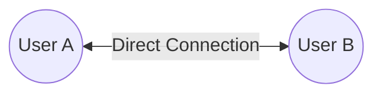
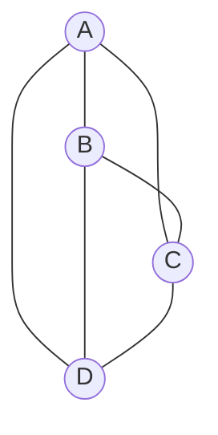
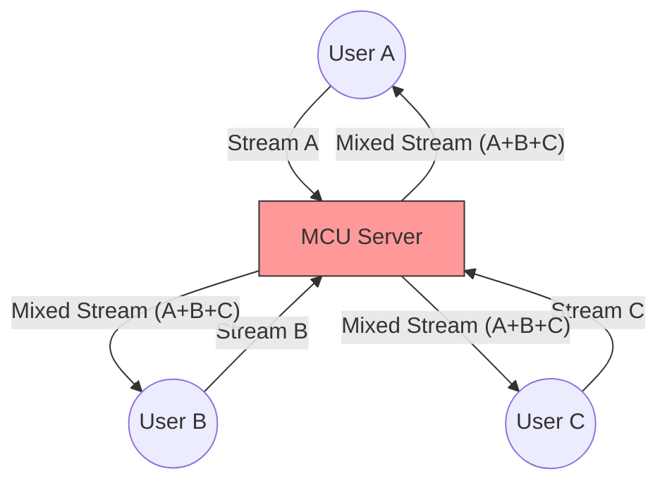
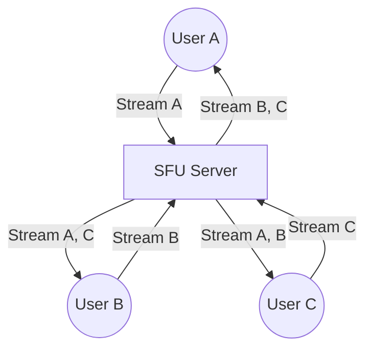

# 📹 System Design: Multi-Conference Video Calls

### 1. Introduction: The Problem

Building a video call app for **two people** is relatively easy. But building one for **10 or 100 people** (Multi-Conference) is extremely hard.

* **Peer:** A user in the call (You, Me).
* **Stream:** The Audio and Video data being sent.

---

### 2. Architecture 1: P2P (Peer-to-Peer) - WebRTC

This is the simplest form, used for 1-on-1 calls.

* **Technology:** **WebRTC** (Web Real-Time Communication).
* **Protocol:** UDP (User Datagram Protocol) - because it's fast and doesn't wait for lost packets.
* **How it works:**
* **No Server:** The audio/video goes *directly* from User A to User B.
* **Cost:** Almost **Free** (only internet bandwidth is used).

---

### 3. Architecture 2: Mesh P2P (The "All-to-All" Mess)

What if **3 or 4 people** want to talk without a server?

* **Concept:** Everyone connects to everyone directly.
* **How it works:**
* If there are 4 users, User A must send their stream to B, C, and D.
* User A also receives streams from B, C, and D.

* **The Problem (Scalability):**
* **Load:** Your computer has to upload 3 times and download 3 times.
* **Chaos:** If a 5th person joins, everyone has to make a new connection to them.
* **Limit:** This crashes easily with more than 4-5 people. Not suitable for large meetings.

*(Everyone is connected to everyone)*

---

### 4. Architecture 3: MCU (Multi-Point Control Unit)

To solve the Mesh mess, we introduce a **Server**.

* **Concept:** The server does the heavy lifting.
* **How it works:**
1. All users send their streams to the **MCU Server**.
2. The Server **mixes** (combines) all the streams into **One Single Video**.
3. The Server sends this *one combined video* back to everyone.

* **Pros:** Client-side is light (you only download 1 stream).
* **Cons (The Dealbreaker):**
* **CPU Cost:** Mixing video in real-time is incredibly expensive for the server.
* **Flexibility:** You (the user) can't mute just "User C" because the audio is already mixed. You can't maximize "User B" because the video is already mixed.

---

### 5. Architecture 4: SFU (Selective Forwarding Unit) - The Modern Standard

This is what **Zoom**, **Google Meet**, and **Teams** use. It's the best balance.

* **Concept:** The server acts as a smart "Router" or "Forwarder".
* **How it works:**
1. Everyone sends their stream to the **SFU Server**.
2. The Server **does NOT mix** them.
3. It simply **forwards** the separate streams to other users.
4. *Example:* User A receives separate streams for B, C, and D.

* **Why it's "Selective":** The server can be smart.
* If User A minimizes User B, the server can stop sending User B's high-quality video to A to save bandwidth.

* **Pros:**
* **Cheaper Server:** No heavy video processing/mixing.
* **Flexible:** You can mute specific people or pin specific videos because you receive them as separate tracks.

---

### 6. Summary Comparison

| Architecture | Description | Scalability | Cost | Pros/Cons |
| --- | --- | --- | --- | --- |
| **P2P (WebRTC)** | Direct 1-on-1 | Low (2 users) | Free | Simple, but only for 2 people. |
| **Mesh P2P** | Everyone connects to everyone | Low (4-5 users) | Low | High load on user's device (CPU/Bandwidth). |
| **MCU** | Server mixes everything into one | High | Very High | Expensive server, no layout flexibility for user. |
| **SFU** | Server forwards individual streams | **Very High** | Medium | **Best Approach.** Used by Zoom/Meet. Flexible & Scalable. |

### 7. Glossary (Hard Words)

* **WebRTC:** A free, open project that provides browsers with Real-Time Communications capabilities via simple APIs.
* **UDP:** A fast communication protocol used for video because it prefers speed over accuracy (dropping a frame is better than freezing the video).
* **Mediasoup:** A popular open-source **SFU** library mentioned in the video for building these systems.
* **Transcoding:** Converting video from one format/quality to another (not used in SFU, used in Streaming).

