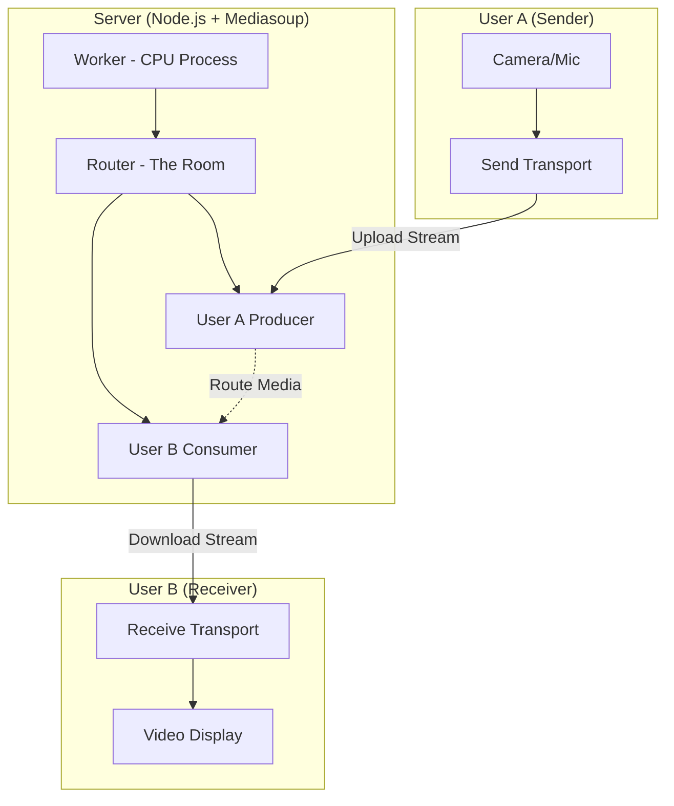

# 🎥 System Design: Building a Video Call App with Mediasoup

### 1. What is Mediasoup?

Mediasoup is a **Selective Forwarding Unit (SFU)** library for Node.js.

* **Simple Explanation:** In an MCU (old way), the server mixes all videos into one. In an SFU (Mediasoup way), the server acts like a **smart router**. It takes your video and simply forwards (relays) it to everyone else without changing it. This makes it super fast and low-latency.

### 2. Core Concepts (Hard Words Explained)

| Term | Simple Explanation |
| --- | --- |
| **Signaling** | The "chat" between servers to tell everyone: "Hey, a new person joined!" Mediasoup doesn't do this; you use **Socket.io** for it. |
| **Worker** | A single C++ process on your server. Usually, if you have 4 CPUs, you run 4 Workers. |
| **Router** | Created by a Worker. Think of it as a **Virtual Room**. It handles the routing of audio/video for one specific meeting. |
| **Producer** | A user who is **sending** their camera/mic data to the server. |
| **Consumer** | A user who is **receiving** someone else's video/audio from the server. |
| **Transport** | The "Pipe" or "Connection" between the Client and the Server. |

---

### 3. The Architecture Flow (Step-by-Step)

#### **Step 1: The Setup (Server Side)**

When your server starts:

1. **Worker Pool:** You create one **Worker** per CPU core.
2. **Router:** When a user creates a meeting, the server picks a worker and tells it to create a **Router** (the room).

#### **Step 2: Connecting a User**

Every user needs **two pipes (Transports)** on both the Client and the Server:

1. **Send Transport:** For sending your own video/audio.
2. **Receive Transport:** For receiving everyone else's video/audio.

#### **Step 3: Producing Media (Sending your Video)**

1. **Client:** Captures camera/mic using `getUserMedia`.
2. **Handshake:** The client asks the server to "Connect" their local **Send Transport** to the server's **Send Transport**.
3. **Produce:** The client starts sending data. Mediasoup creates a **Producer** object on the server to manage this stream.

#### **Step 4: Consuming Media (Watching others)**

This is where it gets tricky. If User B wants to watch User A:

1. **Request:** User B's client asks the server: *"I want to watch User A."*
2. **Server Side Consumer:** The server creates a **Consumer** object. It connects **User A's Producer** to **User B's Receive Transport**.
3. **Pause/Resume:** The server creates the consumer in a **Paused** state. Once the client is ready, it sends a signal to **Resume**.
4. **Display:** User B now receives the stream and plays it in a video tile.

---

### 4. Visualizing the Mediasoup Flow

---

### 5. Detailed Logic Checklist

1. **Workers:** Use multiple workers to utilize all CPU cores.
2. **Device:** On the frontend, you must load a **Mediasoup Device**. It needs the "Capabilities" (codecs like VP8/H264) from the server's Router.
3. **DTLS Parameters:** These are security keys exchanged to encrypt the video "pipes" (Transports).
4. **Multi-User Logic:** * If there are 3 people (A, B, C), and you are **User C**:
* You will have **1 Producer** (yourself).
* You will have **2 Consumers** (one for A, one for B).

### 🌟 Key Takeaway

Mediasoup is **low-level**. It gives you the bricks (Transports, Producers, Consumers), but you have to build the house yourself (using Socket.io to manage who connects to whom).

**Why use this instead of P2P?**
In P2P, if 10 people are in a call, you have to upload your video 9 times. In Mediasoup SFU, you upload **once**, and the server handles the rest!