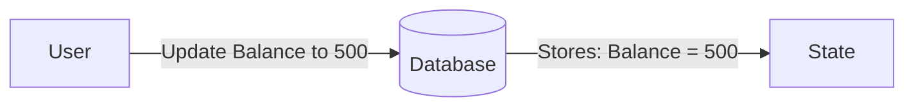
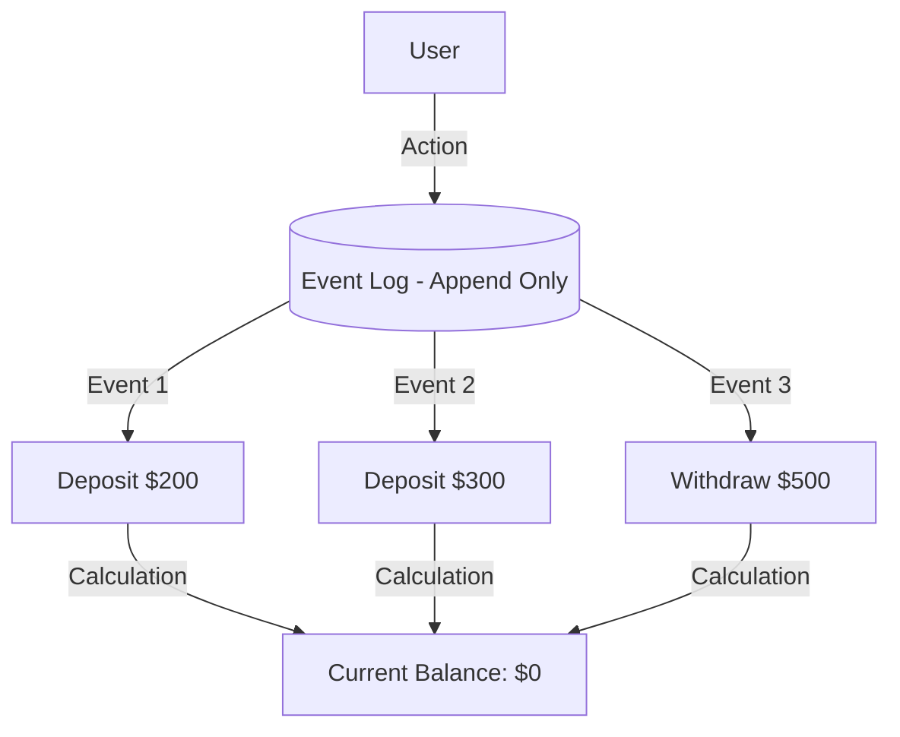
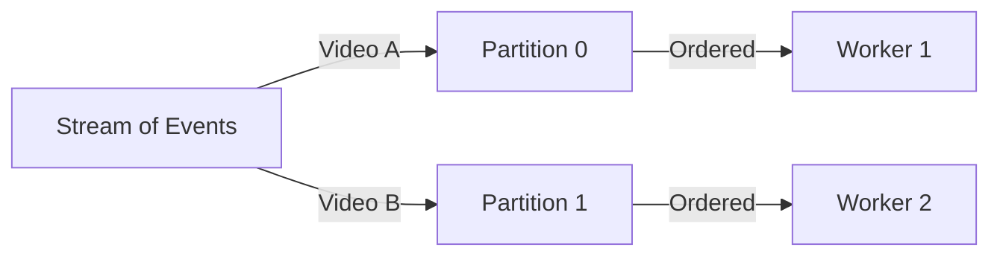

# 🚀 System Design: Event Sourcing

### 1. The Traditional Way (CRUD)

In most apps, we use **CRUD** (Create, Read, Update, Delete). When data changes, we **overwrite** the old data in the database.

* **Example:** You update a product price from $90 to $100.
* **What happens in DB:** The number `90` is erased and replaced with `100`.
* **The Problem:** You lost history. You don't know *when* it was 90 or *why* it changed. If there's a bug or a race condition (two users updating at once), you might end up with corrupted data and no way to trace what happened.

---

### 2. What is Event Sourcing?

Instead of storing just the **Current State** (e.g., "Balance is $500"), we store **every single event** that led to that state.

* **Core Concept:** The database is not a destination; it's a **Log of Events**.
* **Source of Truth:** The sequence of events is the only truth. The current state is just a calculation derived from them.

**Visualizing the Difference:**

**Traditional (CRUD):**

**Event Sourcing:**

---

### 3. Key Concepts

#### **A. Append-Only Log**

You **never** update or delete an event. You only **add** (append) new ones to the end of the list.

* *Analogy:* Like a traditional accounting ledger. If you make a mistake, you don't use an eraser. You add a new entry to correct it.

#### **B. Replay & Hydration**

How do we know the current balance if we only store events?

* **Hydration:** The process of reading all past events (Deposit 200 -> Add 300 -> Withdraw 500) and calculating the final result (0).
* **Replay:** You can "replay" events to see exactly what the state was at any point in history.
* *Superpower:* **Time Travel.** You can answer: "What was the user's balance exactly 1 month ago?" by just replaying events up to that date.

#### **C. Audit Trail**

Since you store every action, you have a perfect audit trail.

* *Use Case:* If a user complains "Why is my balance $0?", you can show them the exact log: "You deposited $200, then $300, but then you withdrew $500."

---

### 4. Practical Example: Video Processing System

Imagine building a YouTube-like backend where users upload videos.

**The Problem with Traditional State Management:**

1. User uploads video → DB Status: `Uploaded`.
2. Worker picks video → DB Status: `Processing`.
3. Worker finishes → DB Status: `Success`.
* *Risk:* What if the database is busy when the worker finishes? The status might stay stuck on `Processing` forever, even though the work is done. You have no way to know what really happened.

**The Event Sourcing Solution:**
Instead of updating a status column, emit events:

1. `VideoUploaded` (Payload: ID, Path)
2. `VideoProcessingStarted` (Timestamp)
3. `VideoProcessingCompleted` (Success)

If the system crashes, you just replay the events. If you see `Started` but no `Completed`, you know exactly where it failed.

---

### 5. Challenges & Solutions (Kafka)

#### **The Sequencing Problem**

If you have multiple workers (servers) processing events for the same video, order matters.

* *Scenario:*
* Event 1: `VideoUploaded` (Picked by Worker A)
* Event 2: `ProcessingStarted` (Picked by Worker B)

* *Risk:* If Worker B is faster, it might say "Processing Started" before Worker A says "Uploaded". The state becomes corrupted.

#### **Solution: Kafka Consumer Groups & Partitions**

Use **Apache Kafka** to manage your event stream.

* **Partitions:** Divide events into lanes (Partitions).
* **Rule:** All events for a specific Video ID (e.g., Video A) always go to the **same partition**.
* **Guarantee:** One worker listens to one partition. This guarantees that `Uploaded` -> `Started` -> `Success` are processed **in order** by the same worker.

---

### 🌟 Summary Checklist for You

1. **Use Event Sourcing when:** Audit trails, history, and "Time Travel" debugging are important (e.g., Banking, Orders, Logistics).
2. **Don't use it for:** Simple apps where history doesn't matter (e.g., a simple To-Do list app).
3. **The "Ah-ha" Moment:** Your database is just a cache of the current state. The *real* data is the log of events.
4. **CQRS (Teaser):** Event Sourcing is often paired with **CQRS** (Command Query Responsibility Segregation) to separate the heavy writing (Events) from fast reading (Cached Views), which will likely be the next topic to learn!