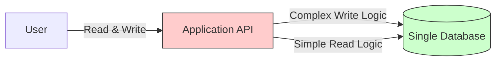
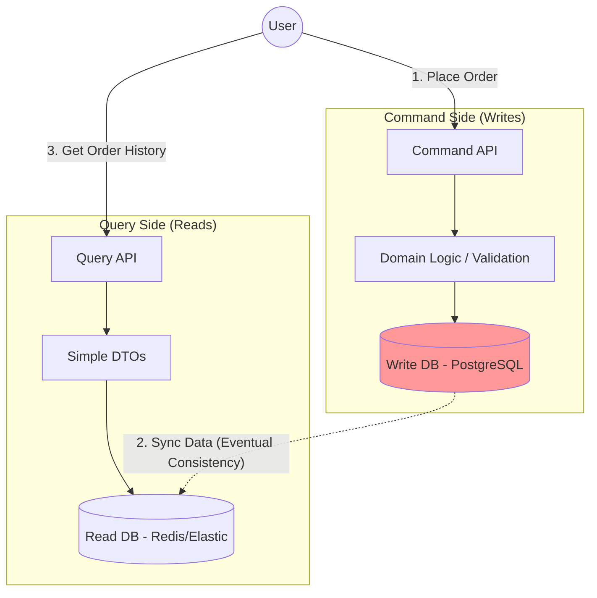
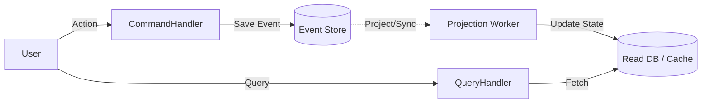
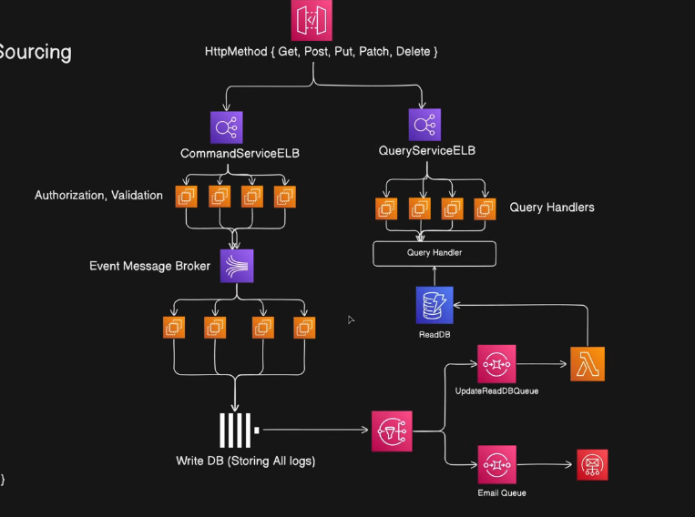

# CQRS System Design Pattern Notes

Based on the video **"CQRS System Design Pattern"** by **Piyush Garg**, here are the exact notes and diagrams explaining the concepts he covers.

### 1. The Problem: Traditional Monolithic Architecture (CRUD)

In a standard application (like a simple e-commerce site), we usually have a **single model** that handles everything.

* **The Issue:** You have one `OrderService` and one `Database`.
* **The Mismatch:**
* **Writes (Commands):** Are complex. You need to validate payment, check inventory, and create a transaction.
* **Reads (Queries):** Are simple. You just want to `SELECT * FROM Orders`.

* **Scaling Problem:** In the real world, **Reads are 100x higher than Writes**. But in this architecture, if you want to scale the "Read" capability, you have to scale the *entire* service (including the heavy Write logic), which is a waste of resources.

**Visualizing the Problem (CRUD Model):**

---

### 2. The Solution: CQS (Command Query Separation)

Before jumping to CQRS, Piyush explains the coding principle **CQS**. It states that a function should be one of two things, never both:

1. **Command:** performs an action (Update/Insert) and returns `void`.
2. **Query:** Returns data and changes nothing.

> **Rule:** "Asking a question should not change the answer."

---

### 3. What is CQRS? (Command Query Responsibility Segregation)

CQRS takes CQS to the system architecture level. It splits your application into two separate parts: **The Command Side** and **The Query Side**.

#### **A. The Split**

* **Command Service (Write):** Handles all business logic, validations, and complex transactions. It is optimized for **Consistency**.
* **Query Service (Read):** Handles fetching data. It is optimized for **Speed**.

#### **B. Separate Databases (The Advanced Pattern)**

Piyush emphasizes that true CQRS often involves using **different databases** for each side.

* **Write DB:** A Relational DB (PostgreSQL/MySQL) to ensure data integrity (ACID properties).
* **Read DB:** A NoSQL DB (MongoDB/ElasticSearch/Redis) optimized for super-fast searching.

**Visualizing CQRS Architecture:**

---

### 4. How Data Synchronization Works

If we have two databases, how do they stay in sync?

1. **User Writes:** The user sends a `CreateOrder` command to the Write DB.
2. **Event Publishing:** The Write Service publishes an event (e.g., `OrderCreated`) to a message queue (like **Kafka** or RabbitMQ).
3. **Sync Worker:** A background worker listens to this event and updates the Read DB.
4. **Eventual Consistency:** There might be a slight delay (milliseconds) between the Write and the Read availability. This is the trade-off for massive scalability.

---

### 5. CQRS + Event Sourcing (The "Pro" Move)

Piyush connects this to his previous video (Event Sourcing).

* **Write Side:** Uses **Event Sourcing**. It stores the *history* of what happened (`ItemAdded`, `ItemRemoved`).
* **Read Side:** Uses a **Materialized View**. It stores the *current state* (`Cart Total: $50`).
* **Why?** The Read side doesn't care about history; it just wants to show the user their cart instantly. The Write side needs the history for auditing and complex logic.

**Visualizing CQRS + Event Sourcing:**

---

### Summary Checklist

* **Use CQRS when:** You have a high read-to-write ratio (e.g., Social Media, e-commerce catalog) or complex domain logic.
* **Don't use CQRS when:** You are building a simple CRUD app (it adds unnecessary complexity).
* **Key Benefit:** You can scale the "Read" servers independently from the "Write" servers.

AWS Architecture is shown below

I have analyzed the video **"Back of Envelope Calculation - System Design Concept"** by **Piyush Garg**.

Here are your beautiful, simplified notes on **Back of Envelope Calculations** (also known as "Napkin Math"), a critical skill for senior engineers and system designers.

---

