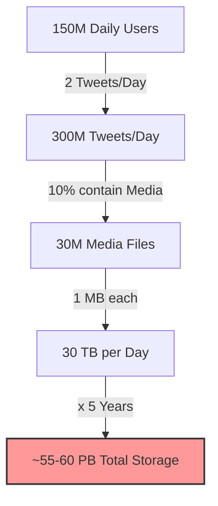

# ✉️ Back of Envelope Calculations (Napkin Math)

### 1. What is it?

Before you build a system (like Twitter or Instagram), you need to know **how much hardware** you need.

* **The Question:** "How many servers, hard drives, and RAM do I need?"
* **The Problem:** If you guess too low, the system crashes. If you guess too high, you waste money.
* **The Solution:** **Back of Envelope Calculation**. It is a quick, rough estimate (usually done on a piece of paper or a napkin) to get a ballpark number for your system's requirements.

### 2. The Golden Rules

1. **Approximation is Key:** Don't use exact numbers.
* *Instead of:* `99,987 / 9.1`
* *Do this:* `100,000 / 10 = 10,000`.

2. **Know Your Units:**
* **Power of 2 vs 10:**
* $2^{10} \approx 10^3 = 1 \text{ Thousand (KB)}$
* $2^{20} \approx 10^6 = 1 \text{ Million (MB)}$
* $2^{30} \approx 10^9 = 1 \text{ Billion (GB)}$

3. **Seconds in a Day:**
* Exact: `86,400` seconds.
* **Napkin Math:** Round it to **100,000 (`10^5`)** seconds for easy calculation.

---

### 3. Latency Numbers (Jeff Dean's List)

You must understand the speed difference between components.

| Operation | Time Taken | Analogy |
| --- | --- | --- |
| **L1 Cache** | 0.5 ns | Heartbeat |
| **RAM (Memory)** | 100 ns | Blinking your eye |
| **SSD (Disk)** | 1 ms (1,000,000 ns) | Brushing your teeth |
| **Network (Packet California->Netherlands)** | 150 ms | A weekend trip |

> **Key Takeaway:** Memory (RAM) is fast but volatile. Disk is slow but permanent. Network is the slowest. **Avoid Disk & Network calls whenever possible!**

---

### 4. Real World Example: Designing "Twitter"

Let's calculate the **Storage** and **QPS (Queries Per Second)** requirements for a Twitter clone.

#### **A. Assumptions (The Inputs)**

* **Total Users:** 300 Million monthly active users.
* **Daily Active Users (DAU):** 50% of Total = **150 Million**.
* **Tweets per User:** 2 tweets/day.
* **Media:** 10% of tweets have images/videos (Size = 1MB).
* **Retention:** Store data for 5 years.

#### **B. Calculating QPS (Traffic Load)**

How many requests per second must our database handle?

$$\text{Total Daily Tweets} = 150 \text{ Million users} \times 2 \text{ tweets} = 300 \text{ Million tweets/day}$$

$$\text{QPS} = \frac{\text{Tweets per Day}}{\text{Seconds in a Day}}$$

$$\text{QPS} = \frac{300,000,000}{100,000} = 3,000 \text{ requests/second}$$

* **Average Load:** 3,000 QPS.
* **Peak Load (Spike):** Usually 2x Average = **6,000 QPS**.

> **Result:** You need a database cluster that handles 6,000 writes/second.

#### **C. Calculating Storage (Hard Drives)**

How much space do we need for 5 years?

1. **Daily Media Storage:**
* Total Tweets: 300 Million.
* Tweets with Media (10%): 30 Million.
* Size per Media: 1 MB.
* $$\text{Daily Storage} = 30 \text{ Million} \times 1 \text{ MB} = 30 \text{ TB/day}$$

2. **5-Year Storage:**
* $$30 \text{ TB} \times 365 \text{ days} \times 5 \text{ years}$$
* $$\approx 30 \times 400 \times 5 = 60,000 \text{ TB} = \mathbf{60 \text{ PB (Petabytes)}}$$

**Visualizing the Storage Need:**

---

### 5. Where is it used? (Practical Application)

1. **System Design Interviews:** If an interviewer asks "Design Instagram," do NOT start drawing boxes immediately. First, do these calculations to decide if you need one server or 1,000 servers.
2. **Cost Estimation:** Before launching a startup, you use this to tell investors: "We need $5,000/month for AWS costs."
3. **Capacity Planning:** If you expect a traffic spike (e.g., Big Billion Days), you calculate: "If traffic doubles, do we have enough RAM?"

### 🌟 Summary Checklist

* **Round numbers** (Day = 100,000 seconds).
* **Write down assumptions** clearly (e.g., "I assume 10% of users upload photos").
* **Label your units** (TB, GB, MB).
* **Experience matters:** The more systems you build, the better your guesses become. Start with a small server (2 CPU, 4GB RAM) in dev, measure it, and then multiply for production.

