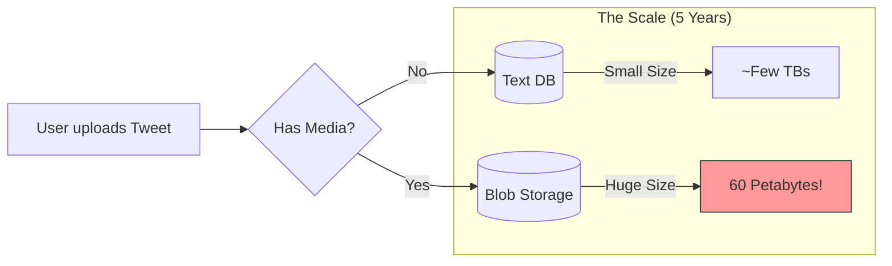

I have analyzed the video **"Back of Envelope Calculation - System Design Concept"** by **Piyush Garg**.

Here are your simpler, clearer notes on this essential System Design skill.

---

# ✉️ Back of Envelope Calculation (Napkin Math)

### 1. What is it?

Imagine you are building a new app (like Twitter). Before you write a single line of code or buy a server, you need to answer:

* *"How many hard drives do I need?"*
* *"How much RAM is required?"*
* *"Will this crash if 1 million people join?"*

**Back of Envelope Calculation** is a rough, quick estimate done (metaphorically on the back of an envelope or napkin) to guess these numbers. It prevents you from over-spending or under-preparing.

### 2. The Cheat Sheet (Magic Numbers)

To do this fast, you need to memorize a few "Magic Numbers" so you don't need a calculator.

#### **A. Seconds in a Day**

* Exact: `86,400` seconds.
* **The Trick:** Round it to **100,000 (`10^5`)** seconds. It makes division super easy!

#### **B. Data Sizes (Power of 2 vs 10)**

Computers count in 2s, Humans count in 10s. For estimates, we treat them as close enough.

| Human Name | Power of 10 | Exact Bytes () | Approximate |
| --- | --- | --- | --- |
| **1 Kilobyte (KB)** |  |  | 1,000 Bytes |
| **1 Megabyte (MB)** |  |  | 1 Million Bytes |
| **1 Gigabyte (GB)** |  |  | 1 Billion Bytes |
| **1 Terabyte (TB)** |  |  | 1 Trillion Bytes |
| **1 Petabyte (PB)** |  |  | 1 Quadrillion Bytes |

#### **C. Latency (Speed of Operations)**

This helps you decide *where* to store data.

* **L1 Cache:** 0.5 ns (Instant)
* **RAM (Memory):** 100 ns (Very Fast - like blinking an eye)
* **Disk (SSD):** 1 ms (Slow - like brushing teeth)
* **Network:** 150 ms (Very Slow - like shipping a package)

> **Rule:** Avoid Disk and Network calls if you want speed. Keep hot data in RAM.

---

### 3. Real World Example: Designing Twitter 🐦

Let's estimate the **Storage** and **Traffic (QPS)** for a Twitter clone.

#### **Step 1: Write Assumptions**

* **Total Users:** 300 Million.
* **Active Daily:** 50% (150 Million).
* **Tweets:** 2 per user/day.
* **Media:** 10% of tweets have a photo/video (Size = 1MB).
* **Retention:** Keep data for 5 years.

#### **Step 2: Calculate QPS (Queries Per Second)**

This tells you how strong your database needs to be.

* **Average Load:** 3,000 writes/sec.
* **Peak Load (Spikes):** Always double it. **6,000 writes/sec**.

#### **Step 3: Calculate Storage**

This tells you how many hard drives to buy.

1. **Media Count:** 10% of 300M tweets = **30 Million** tweets with media.
2. **Daily Space:** .
3. **5 Year Space:**

**Visualizing the Scale:**

---

### 4. Tips for Interviews & Work

1. **Start Small:** In dev, start with a 2 CPU / 4GB RAM server. Measure how many users it handles (e.g., 500). Then multiply to find production needs.
2. **Label Units:** Never write just "50". Write "50 MB" or "50 QPS".
3. **Round Numbers:** Never try to calculate `9987 / 4.2`. Round it to `10000 / 4`. The goal is the *order of magnitude*, not precision.

### 5. Where is this used?

* **System Design Interviews:** Before drawing architecture, show you understand the scale. (e.g., "Since we need 60PB, we definitely need sharding").
* **Budgeting:** To tell your boss, "We need 500 hard drives, and it will cost $X."
* **Crash Prevention:** To realize, "Oh wait, one database server can only handle 2,000 writes/sec, but we need 6,000. We need a cluster."