# 🛡️ Rate Limiting: Protecting Your Server

### 1. What is Rate Limiting?

Your server is just a machine with physical limits (CPU, RAM). It cannot handle infinite requests.

* **The Problem:** If your server can handle **100 requests/minute**, but a user sends **200 requests/minute**, your server will overheat and crash.
* **The Solution:** A **Rate Limiter**. It acts as a guard that sits between the User and the Server.
* **Allowed:** If requests are within the limit (e.g., < 100/min), they pass through.
* **Blocked:** If requests exceed the limit, they are dropped, and the server returns error code **429 (Too Many Requests)**.

```mermaid
graph LR
    User -->|Requests| RL[🛡️ Rate Limiter]
    RL -- "Allowed" --> Server[Server]
    RL -- "Blocked (429 Error)" --> User
    Server -- "Response" --> RL

```

---

### 2. Algorithms to Implement Rate Limiting

#### **A. Token Bucket Algorithm**

Imagine a bucket that holds tokens (coins).

* **Concept:**
* **Bucket:** Holds tokens (e.g., Capacity = 5).
* **Refiller:** Adds tokens at a fixed rate (e.g., 3 tokens/second).
* **Request:** To enter, a request *must* take 1 token from the bucket.

* **Logic:**
* Bucket has tokens? -> Take one, Request passes.
* Bucket empty? -> Request dropped (`429`).

* **Pros:** Allows **bursts** of traffic. If the bucket is full, many requests can pass instantly.
* **Used By:** Amazon, Stripe.

#### **B. Leaky Bucket Algorithm**

Imagine a bucket with a small hole at the bottom.

* **Concept:**
* **Input:** Water (requests) pours in at any speed (bursts allowed).
* **Output:** Water drips out of the hole at a **fixed constant rate**.
* **Overflow:** If the bucket is full, new water spills over (requests are dropped).

* **Key Difference:** It forces a **smooth, stable outflow** to your server, no matter how wild the input traffic is.
* **Pros:** Prevents server overload by smoothing traffic.
* **Cons:** A burst of traffic fills the queue, so newer requests might be dropped while old ones are processed.

#### **C. Fixed Window Counter**

You divide time into fixed blocks (windows), e.g., 1-minute blocks.

* **Rule:** "Max 3 requests per minute."
* **10:00 - 10:01:** Counter starts at 0. Requests increment it. If > 3, drop.
* **10:01 - 10:02:** Counter resets to 0. Start over.

* **The "Edge Case" Bug (The Spike):**
* Imagine a user sends 3 requests at **10:00:59** (allowed).
* Then sends 3 requests at **10:01:01** (allowed, because counter reset).
* **Result:** In just **2 seconds**, the server processed **6 requests** (double the limit!).

#### **D. Sliding Window Log**

To fix the "Edge Case" bug, we track the **exact timestamp** of every request.

* **Concept:**
* Keep a log: `[10:00:59, 10:01:01, 10:01:02]`.
* When a new request comes, count how many logs exist in the *last 1 minute* (sliding window).
* Remove logs older than 1 minute.

* **Pros:** 100% Accurate. Solves the edge case.
* **Cons:** **High Memory Usage**. Storing a timestamp for every single request is expensive.

#### **E. Sliding Window Counter (The Hybrid)**

Combines Fixed Window (low memory) + Sliding Window (accuracy).

* **Concept:** It approximates the count using a weighted formula.
* **Formula:** `Requests in Current Window + (Requests in Previous Window * Overlap %)`
* **Example:**
* Limit: 3 req/min.
* Previous Window: 5 requests (Limit exceeded).
* Current Window: 1 request (Just started).
* We are at the 30% mark of the current minute.
* **Calculation:** `1 (Current) + (5 * 0.7 (Remaining overlap))` = `4.5`.
* **Result:** 4.5 > 3, so **Reject**.

* **Pros:** Fast, memory efficient, and handles the edge case well.

---

### 🌟 Summary Checklist

* **Rate Limiting** = Protecting server resources.
* **Error 429** = "Too Many Requests".
* **Token Bucket** = Good for general use (allows bursts).
* **Leaky Bucket** = Good for stable processing (smooths bursts).
* **Fixed Window** = Simple but has spike issues at edges.
* **Sliding Window Log** = Accurate but memory heavy.
* **Sliding Window Counter** = Best balance of speed and accuracy.