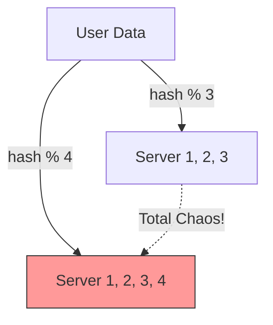
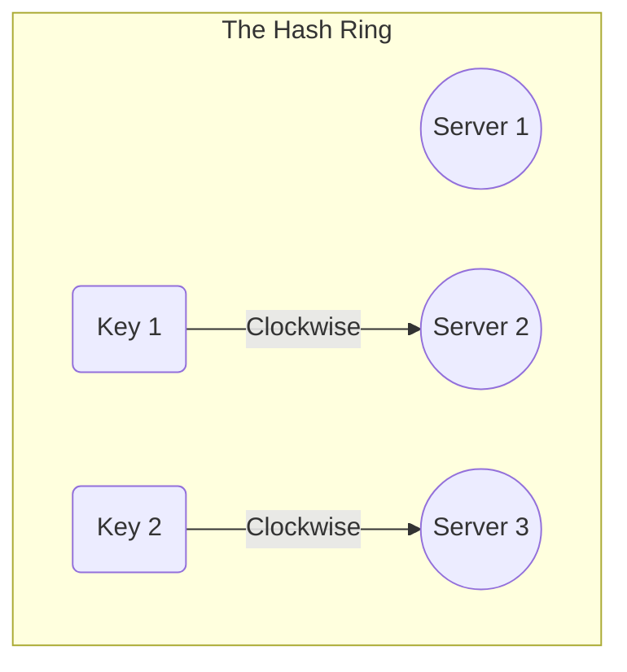
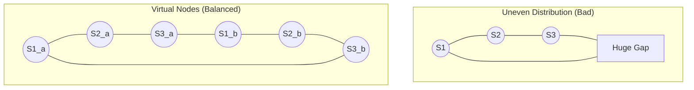

# 🔄 Consistent Hashing: The Magic Ring

### 1. The Problem with Traditional Hashing (`Mod N`)

Imagine you have a huge amount of data (users) and you want to distribute it across 3 database servers.

* **The Old Formula:** `Server Index = hash(key) % N` (where N = Number of Servers).
* If user ID is 1, `1 % 3 = 1` -> Data goes to **Server 1**.
* If user ID is 2, `2 % 3 = 2` -> Data goes to **Server 2**.

* **The Disaster:** What happens if **Server 1 crashes** or you **add Server 4**?
* `N` changes from 3 to 4.
* Now `hash(key) % 4` produces a completely different result for almost **every single user**.
* **Result:** You have to move (re-shuffle) nearly 100% of your data. This causes massive system load and downtime.

---

### 2. The Solution: Consistent Hashing (The Ring)

Instead of a simple list, imagine a **Ring** (a circle) that represents all possible hash values (from 0 to billions).

#### **How it Works:**

1. **Place Servers on the Ring:** Hash the Server IP addresses to place them at random points on the ring.
2. **Place Data on the Ring:** Hash the User Key to place it on the ring.
3. **The Rule:** To find where a key belongs, move **Clockwise** on the ring until you hit the first Server. That server owns the key.

---

### 3. Adding/Removing Servers (Scaling)

The magic happens when you change the number of servers.

* **Scenario:** You add **Server 4** between Server 1 and Server 2.
* **Impact:**
* Keys that were previously mapping to Server 2 *might* now hit Server 4 first.
* Keys mapping to Server 3 are **not affected**.
* Keys mapping to Server 1 are **not affected**.

* **Result:** Only a **small fraction** of keys need to move (specifically, keys between Server 1 and the new Server 4).
* **Benefit:** Massive stability. Adding a node requires moving only `K/N` keys (where K is total keys, N is total nodes).

---

### 4. The Hotspot Problem & Virtual Nodes

**Problem:** What if the servers are placed unevenly?

* Example: Server 1, 2, and 3 end up clustered close together on the ring.
* **Consequence:** One server (the one with the biggest gap before it) gets 90% of the data, while others sit idle. This is a **Hotspot**.

**Solution: Virtual Nodes**
Instead of placing "Server A" once, we place multiple **Virtual Copies** of it (e.g., `Server A_1`, `Server A_2`, `Server A_3`) scattered randomly around the ring.

* **Effect:** This ensures the ring is divided more evenly, so the data load is balanced perfectly across all physical servers.

---

### 🌟 Summary Checklist for You

1. **Consistent Hashing** = A technique to distribute data where adding/removing nodes causes minimal data movement.
2. **The Ring:** Maps 0 to .
3. **Movement:** Keys move **Clockwise** to find their server.
4. **Virtual Nodes:** Solve the problem of uneven data distribution (Hotspots).
5. **Use Cases:**
* **Amazon DynamoDB** (partitioning data).
* **Discord** (chat servers).
* **Load Balancers** (distributing traffic).
* **Caching Systems** (Memcached/Redis).