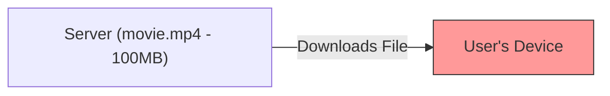
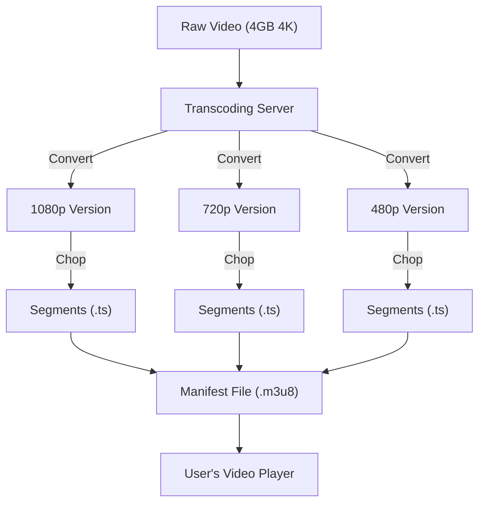

# 🎬 System Design: How Video Streaming Works

### 1. What is a Video?

At its core, a video is just a **sequence of images** (called frames) played at a specific speed (Frame Rate).

* **Frame Rate (FPS):** Images per second.
* 60 FPS = 60 images clicked in 1 second (Very smooth).
* 20 FPS = 20 images/sec (Less smooth).
* 1 FPS = 1 image/sec (Slideshow).

* **The Challenge:** High quality means huge file sizes. A 4K video can be **4-5 GB**. Downloading this purely is slow and buffers on bad networks.

---

### 2. Evolution of Video Delivery

#### **Phase 1: Progressive Download (The Old Way)**

* **Concept:** The client requests the video, and the server sends the **entire file** (e.g., `movie.mp4`).
* **How it works:** You must download the file to play it.
* **Problem:**
* **High Latency:** You have to wait for a buffer before playing.
* **Wasted Bandwidth:** If a user watches 1 minute of a 100MB video and leaves, the remaining data downloaded is wasted.

#### **Phase 2: RTMP & RTSP (Streaming Protocols)**

* **Protocols:** Real-Time Messaging Protocol (RTMP) by Adobe, Real-Time Streaming Protocol (RTSP).
* **Improvement:** Allowed sending video in **chunks** (small parts) rather than the whole file. Low latency.
* **Remaining Problem:** It still sent the **same quality** to everyone.
* *Scenario:* A user on a **Smart Watch** with 3G internet gets the same 4K video as a user on a **TV** with Fiber internet. The Watch user buffers endlessly.

---

### 3. The Modern Solution: Adaptive Bitrate Streaming (ABR)

This is how Netflix, YouTube, and Hotstar work today.

**Core Concept:**
Instead of one file, we create **multiple versions** of the same video at different qualities (Bitrates) and split them into small **Segments** (chunks).

1. **Transcoding:** Convert the original 4K video into 480p, 720p, 1080p, and 4K versions.
2. **Segmentation:** Chop these versions into small 2-10 second clips (Segments).
3. **Manifest File (The Menu):** Create an index file (like a menu) that tells the player where all these chunks are.

**How it "Adapts":**
The **Client (Player)** decides what to request based on:

* **Internet Speed:** Slow net? Request 480p chunks. Fast net? Request 4K chunks.
* **Screen Size:** Mobile? Request 720p. TV? Request 4K.

**Visualizing ABR Architecture:**

---

### 4. Key Protocols (HLS vs DASH)

#### **A. HLS (HTTP Live Streaming)**

* **Creator:** Apple.
* **Manifest File:** `.m3u8`
* **Segment Files:** `.ts`
* **How it works:** The `.m3u8` file is a text file listing links to the chunks. The player reads this and downloads chunks in order.
* **Status:** Most popular standard today.

#### **B. MPEG-DASH (Dynamic Adaptive Streaming over HTTP)**

* **Creator:** Open Standard.
* **Manifest File:** `.mpd` (Media Presentation Description).
* **Concept:** Similar to HLS but codec-agnostic.

---

### 5. Practical Implementation (The Demo)

The video demonstrates using **ImageKit** (a media CDN tool) to automate this.

1. **Upload:** You upload a standard `.mp4` file.
2. **Magic URL:** Instead of requesting `.mp4`, you change the URL extension.
* **For HLS:** Append `/ik-master.m3u8` to the URL.
* **For DASH:** Append `/ik-master.mpd`.

3. **Result:** The server automatically transcodes the video on the fly and returns the Manifest file. The browser then requests the appropriate chunks (240p, 360p, etc.) based on network conditions.

### 🌟 Summary Checklist

* **Video** = Sequence of images.
* **Progressive Download** = Bad for mobile/slow net (downloads everything).
* **Adaptive Bitrate (ABR)** = Good. Changes quality dynamically.
* **Transcoding** = Converting video to different resolutions (480p, 720p).
* **Manifest (.m3u8)** = The "Menu" file that tells the player where the video chunks are.
* **Client-Side Logic:** The *Player* is smart. It checks internet speed and decides which chunk quality to download next.