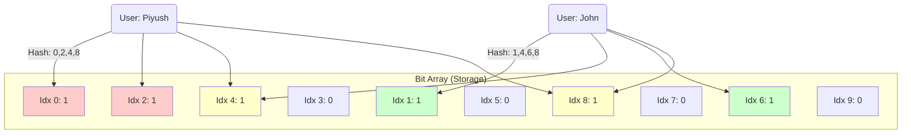

I have analyzed the video **"What are Bloom Filters? | System Design"** by **Piyush Garg** again to ensure no detail is missed.

Here are your **comprehensive, simple, and structured notes** on Bloom Filters.

---

# 🌸 System Design: Bloom Filters

### 1. The Real-World Problem: "Username Taken"

Imagine you are building **Twitter** (or X.com) or **Gmail**. You have **20 Million+ users**.
When a new user tries to sign up with the username `"Piyush"`, you must check if that name is already taken.

**Why Traditional Methods Fail:**

1. **Database Search (`SELECT *`):**
* Checking a database with 20 million records is **Slow** (High Latency).
* A user might try 3-4 usernames (e.g., "Piyush", "Piyush123"). This multiplies the load on your database.

2. **HashMap (Cache):**
* You could store all usernames in RAM using a HashMap for instant checking (`O(1)`).
* **Problem:** It is **Not Space Efficient**. Storing millions of strings takes up huge amounts of RAM (Memory), which is expensive.

**The Solution:** We need something **Fast** (like a HashMap) but **Tiny** (Low Memory). This is the **Bloom Filter**.

---

### 2. What is a Bloom Filter?

A Bloom Filter is a **Space-Efficient, Probabilistic Data Structure**.

* **Space Efficient:** It takes very little memory compared to a HashMap.
* **Probabilistic:** It deals in probabilities, meaning it is *mostly* correct, but not always.

**The Golden Rule of Bloom Filters:**

* If it says **"NO"** (Not Present): It is **100% True**. (Trust it blindly).
* If it says **"YES"** (Present): It is **Maybe True**. (There is a chance it is lying).

> **Key Term:** This "lie" where it says "Yes" but the item isn't there is called a **False Positive**. It **never** gives a False Negative.

---

### 3. How It Works (The Mechanics)

A Bloom Filter doesn't store the actual text (like "Piyush"). It stores **Bits** (0s and 1s).

**Components:**

1. **Bit Array:** A long list of boxes, all initially set to `0`.
2. **Hash Functions:** Math formulas that convert text into numbers (indexes).

#### **Step-by-Step Walkthrough (From the Video)**

**Setup:** Imagine an array of 10 bits (Index 0 to 9).
`[0, 0, 0, 0, 0, 0, 0, 0, 0, 0]`

**A. Adding User "Piyush"**

1. Run "Piyush" through hash functions.
2. Resulting Indexes: `0, 2, 4, 8`.
3. **Action:** Mark these positions as `1`.

* **Array:** `[1, 0, 1, 0, 1, 0, 0, 0, 1, 0]`

**B. Adding User "John"**

1. Run "John" through hash functions.
2. Resulting Indexes: `1, 4, 6, 8`.
3. **Action:** Mark positions as `1`.
* *Note:* Index `4` and `8` were *already* `1` (from Piyush). We leave them as `1`.
* **Array:** `[1, 1, 1, 0, 1, 0, 1, 0, 1, 0]`

**C. Checking User "Lemon" (Availability Check)**

1. Hash "Lemon". Result: `1, 2, 4, 7`.
2. **Check:** Are all these bits `1`?
* Index 1? Yes.
* Index 2? Yes.
* Index 4? Yes.
* Index 7? **NO (It is 0)**.

3. **Conclusion:** Since Index 7 is 0, "Lemon" is **Definitely Available**. We allow the user to take it.

**D. The Problem: Checking User "Apple" (False Positive)**

1. Hash "Apple". Result: `1, 2, 6, 8`.
2. **Check:**
* Index 1? Yes (set by John).
* Index 2? Yes (set by Piyush).
* Index 6? Yes (set by John).
* Index 8? Yes (set by Both).

3. **Conclusion:** The Bloom Filter sees all `1`s and says **"Username Taken"**.
4. **Reality:** We never added "Apple"! The filter is confused because bits set by "Piyush" and "John" accidentally formed the pattern for "Apple".
5. **Result:** We tell the user "Apple is taken" (even though it's free). This is the **False Positive**.

---

### 4. Visual Diagram

*(Yellow boxes = Collisions, where both users mapped to the same spot)*

---

### 5. Why do we accept the "False Positive"?

You might think, "Why use a system that lies?"

* **The Trade-off:** In the "Apple" example, we rejected a valid username. The user will just try another name (e.g., "Apple123"). This is a minor inconvenience to the user.
* **The Gain:** We saved massive amounts of RAM and Database calls.
* **Tuning:** We can reduce these errors by:
1. **Increasing Array Size:** Instead of 10 bits, use 1000 bits. More space = fewer collisions.
2. **More Hash Functions:** Adds more unique patterns.

### 6. Where is it used in Real Life?

1. **Google Chrome:** Uses a Bloom Filter to check if a URL is malicious.
* If Filter says "Safe" -> It is definitely safe.
* If Filter says "Malicious" -> Chrome double-checks with its server to be sure.

2. **Databases (Cassandra/PostgreSQL):** Uses it to check if a data row exists on the hard disk.
* If Filter says "No" -> Database saves time by **not** reading the disk.

3. **Content Delivery Networks (CDNs):** To check if content is cached.

---

### 7. Glossary (Complex Words Simplified)

| Hard Word | Simple Explanation |
| --- | --- |
| **Probabilistic Data Structure** | A fancy way of saying "A storage system that works on probability/chance, not absolute certainty." |
| **False Positive** | The system alarms "Yes, it is here!" when it is actually NOT there. (The only error Bloom Filters make). |
| **False Negative** | The system says "No, it's not here" when it actually IS there. (Bloom Filters **NEVER** do this). |
| **Collision** | When two different inputs (like Piyush and John) try to claim the same bit (Index 4) in the array. |
| **Bit Array** | A simple list of switches that can only be ON (1) or OFF (0). |
| **Lookup Time O(1)** | Computer science term meaning "Instant". It takes the same amount of time regardless of how many users exist. |

### 8. Summary Checklist

* **Bloom Filters** save memory but sacrifice 100% accuracy.
* They are used to quickly check **"Is this item in the set?"**
* **Result "NO"** = 100% Trusted.
* **Result "YES"** = Double check required (or accept the error).
* **Key Design:** Uses a Bit Array + Hash Functions.